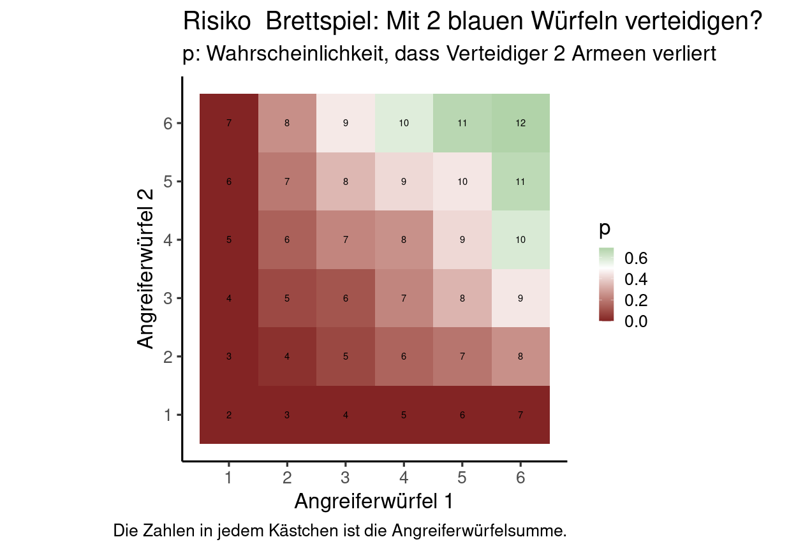

<!-- README.md is generated from README.Rmd. Please edit that file -->

# Risiko_Brettspiel

<!-- badges: start -->
<!-- badges: end -->

Empfehlungen für das Brettspiel “Risiko”, basierend auf statistischen
Simulationen.

Faustregeln:

> Beträgt die Summe der Angreiferwürfel 6 oder weniger unbedingt mit 2
> Würfeln würfeln!

> Beträgt sie mehr als 10, auf keinen Fall mit beiden würfeln, sondern
> nur einem.

## Simulationen

``` r
library(tidyverse)
#> Warning: replacing previous import 'lifecycle::last_warnings' by
#> 'rlang::last_warnings' when loading 'pillar'
#> Warning: replacing previous import 'lifecycle::last_warnings' by
#> 'rlang::last_warnings' when loading 'tibble'
#> Warning: replacing previous import 'lifecycle::last_warnings' by
#> 'rlang::last_warnings' when loading 'hms'
#> ── Attaching packages ─────────────────────────────────────── tidyverse 1.3.1 ──
#> ✔ ggplot2 3.3.5     ✔ purrr   0.3.4
#> ✔ tibble  3.1.3     ✔ dplyr   1.0.7
#> ✔ tidyr   1.1.3     ✔ stringr 1.4.0
#> ✔ readr   2.0.1     ✔ forcats 0.5.1
#> ── Conflicts ────────────────────────────────────────── tidyverse_conflicts() ──
#> ✖ dplyr::filter() masks stats::filter()
#> ✖ dplyr::lag()    masks stats::lag()

set.seed(1)
res <- lapply(1:6, function(die1) { # die ist übrigens Englisch für Würfel.
  lapply(1:6, function(die2) {
    attack <- c(die1, die2)
    defense <- t(replicate(1e4, sample(1:6, 2, replace=TRUE)))
    defense_wins <- rowSums( t(apply(defense, 1, function(x) sort(x) >= sort(attack))) )
    c(attack1=die1, attack2=die2, 
      defense_looses=sum(defense_wins==0)/length(defense_wins),
      defense_wins=sum(defense_wins==2)/length(defense_wins),
      both_loose_one=sum(defense_wins==1)/length(defense_wins))    
  })
}) %>% 
  unlist(., recursive = F) %>% bind_rows %>% 
  mutate(quersumme=attack1+attack2)

head(res)
#> # A tibble: 6 × 6
#>   attack1 attack2 defense_looses defense_wins both_loose_one quersumme
#>     <dbl>   <dbl>          <dbl>        <dbl>          <dbl>     <dbl>
#> 1       1       1              0        1             0              2
#> 2       1       2              0        0.974         0.0261         3
#> 3       1       3              0        0.892         0.108          4
#> 4       1       4              0        0.746         0.254          5
#> 5       1       5              0        0.561         0.439          6
#> 6       1       6              0        0.302         0.698          7
```

Wir würfeln 10.000 mal (1e4) mit 2 blauen Verteidigungswürfeln gegen
jede mögliche Kombination aus roten Angreiferwürfeln (`attack1/2`), und
berechnen dann die Wahrscheinlichkeit dass wir zwei Armeen verlieren
(`defense_looses`), eine Armee verlieren (`both_loose_one`) oder zweimal
gewinnen (`defense_wins`).

## Wahrscheinlichkeit, zweimal zu gewinnen

``` r
res %>%
   ggplot(aes(attack1, attack2, fill=defense_wins, label=quersumme))+geom_tile() + 
  geom_text()+
  scale_fill_gradient2(name="p",midpoint = 0.5, high="forestgreen", low=scales::muted("firebrick2")) + 
  theme_classic(25) + 
  scale_x_continuous(name="Angreiferwürfel 1",breaks=1:6)+ 
  scale_y_continuous(name="Angreiferwürfel 2", breaks=1:6)+
  coord_fixed()+
  labs(caption = "Die Zahlen in jedem Kästchen ist die Angreiferwürfelsumme.") +
  ggtitle("Risiko  Brettspiel: Mit 2 blauen Würfeln verteidigen?",
          "p: Wahrscheinlichkeit, dass Angreifer 2 Armeen verliert")
```

<!-- --> Ist die Summe
der beiden Angreiferwürfel sechs oder weniger hat man \> 50 % Chance,
beides zu gewinnen und sollte.

## Wahrscheinlichkeit, zweimal zu verlieren

``` r
res %>%
  ggplot(aes(attack1, attack2, fill=defense_looses, label=quersumme))+geom_tile() + 
  geom_text()+
  scale_fill_gradient2(name="p",midpoint = 0.5, high="forestgreen", low=scales::muted("firebrick2")) + 
  theme_classic(25) + 
  scale_x_continuous(name="Angreiferwürfel 1",breaks=1:6)+ 
  scale_y_continuous(name="Angreiferwürfel 2", breaks=1:6)+
  coord_fixed()+
  labs(caption = "Die Zahlen in jedem Kästchen ist die Angreiferwürfelsumme.") +
  ggtitle("Risiko  Brettspiel: Mit 2 blauen Würfeln verteidigen?",
          "p: Wahrscheinlichkeit, dass Verteidiger 2 Armeen verliert")
```

<!-- --> Bei
Angreiferwürfelsumme 10 oder höher verliert man meistens beide Armeen –
auf keinen Fall mit 2 Würfeln.

## Wahrscheinlichkeiten

``` r
res %>%
  pivot_longer(defense_looses:both_loose_one) %>%
  ggplot(aes(quersumme, value, col=name))+geom_jitter(height=0, width=0.1) +
  scale_x_continuous(breaks=1:12) + theme_bw() +
  geom_smooth(se=F) + xlab("Summe der beiden Angreiferwürfel") +
  ylab("Wahrscheinlichkeit") + 
  ggtitle("Angreiferwürfelsumme als Faustregel verwenden")
#> `geom_smooth()` using method = 'loess' and formula 'y ~ x'
```

<!-- --> Die
Angreiferwürfelsumme ist eine gute Vorhersage für den Erfolg.

# Session info

Versionen der verwendeten R Softwarepakete.

``` r
devtools::session_info()
#> ─ Session info ───────────────────────────────────────────────────────────────
#>  setting  value
#>  version  R version 4.2.1 (2022-06-23)
#>  os       Ubuntu 20.04.4 LTS
#>  system   x86_64, linux-gnu
#>  ui       X11
#>  language en_US:en
#>  collate  en_US.UTF-8
#>  ctype    en_US.UTF-8
#>  tz       Europe/Berlin
#>  date     2024-01-12
#>  pandoc   2.17.1.1 @ /usr/lib/rstudio/bin/quarto/bin/ (via rmarkdown)
#> 
#> ─ Packages ───────────────────────────────────────────────────────────────────
#>  package     * version date (UTC) lib source
#>  assertthat    0.2.1   2019-03-21 [3] CRAN (R 4.0.0)
#>  backports     1.2.1   2020-12-09 [3] CRAN (R 4.0.3)
#>  broom         0.7.9   2021-07-27 [3] CRAN (R 4.1.0)
#>  cachem        1.0.6   2021-08-19 [1] CRAN (R 4.2.0)
#>  callr         3.7.0   2021-04-20 [3] CRAN (R 4.0.5)
#>  cellranger    1.1.0   2016-07-27 [3] CRAN (R 4.0.0)
#>  cli           3.3.0   2022-04-25 [1] CRAN (R 4.2.0)
#>  colorspace    2.0-2   2021-06-24 [3] CRAN (R 4.1.0)
#>  crayon        1.4.1   2021-02-08 [3] CRAN (R 4.0.3)
#>  DBI           1.1.1   2021-01-15 [3] CRAN (R 4.0.3)
#>  dbplyr        2.1.1   2021-04-06 [3] CRAN (R 4.0.5)
#>  desc          1.4.1   2022-03-06 [1] CRAN (R 4.2.0)
#>  devtools      2.4.3   2021-11-30 [1] CRAN (R 4.2.0)
#>  digest        0.6.27  2020-10-24 [3] CRAN (R 4.0.3)
#>  dplyr       * 1.0.7   2021-06-18 [3] CRAN (R 4.1.0)
#>  ellipsis      0.3.2   2021-04-29 [3] CRAN (R 4.0.5)
#>  evaluate      0.14    2019-05-28 [3] CRAN (R 4.0.0)
#>  fansi         0.5.0   2021-05-25 [3] CRAN (R 4.1.0)
#>  farver        2.1.0   2021-02-28 [3] CRAN (R 4.0.4)
#>  fastmap       1.1.0   2021-01-25 [1] CRAN (R 4.2.0)
#>  forcats     * 0.5.1   2021-01-27 [3] CRAN (R 4.0.3)
#>  fs            1.5.0   2020-07-31 [3] CRAN (R 4.0.2)
#>  generics      0.1.0   2020-10-31 [3] CRAN (R 4.0.3)
#>  ggplot2     * 3.3.5   2021-06-25 [3] CRAN (R 4.1.0)
#>  glue          1.6.2   2022-02-24 [1] CRAN (R 4.2.0)
#>  gtable        0.3.0   2019-03-25 [3] CRAN (R 4.0.0)
#>  haven         2.4.3   2021-08-04 [3] CRAN (R 4.1.0)
#>  highr         0.9     2021-04-16 [3] CRAN (R 4.0.5)
#>  hms           1.1.0   2021-05-17 [3] CRAN (R 4.0.5)
#>  htmltools     0.5.2   2021-08-25 [1] CRAN (R 4.2.0)
#>  httr          1.4.2   2020-07-20 [3] CRAN (R 4.0.2)
#>  jsonlite      1.7.2   2020-12-09 [3] CRAN (R 4.0.3)
#>  knitr         1.33    2021-04-24 [3] CRAN (R 4.0.5)
#>  labeling      0.4.2   2020-10-20 [3] CRAN (R 4.0.3)
#>  lattice       0.20-45 2021-09-22 [4] CRAN (R 4.2.0)
#>  lifecycle     1.0.0   2021-02-15 [3] CRAN (R 4.0.4)
#>  lubridate     1.7.10  2021-02-26 [3] CRAN (R 4.0.4)
#>  magrittr      2.0.1   2020-11-17 [3] CRAN (R 4.0.3)
#>  Matrix        1.5-1   2022-09-13 [1] CRAN (R 4.2.1)
#>  memoise       2.0.1   2021-11-26 [1] CRAN (R 4.2.0)
#>  mgcv          1.8-40  2022-03-29 [4] CRAN (R 4.1.3)
#>  modelr        0.1.8   2020-05-19 [3] CRAN (R 4.0.0)
#>  munsell       0.5.0   2018-06-12 [3] CRAN (R 4.0.0)
#>  nlme          3.1-157 2022-03-25 [4] CRAN (R 4.1.3)
#>  pillar        1.6.2   2021-07-29 [3] CRAN (R 4.1.0)
#>  pkgbuild      1.3.1   2021-12-20 [1] CRAN (R 4.2.0)
#>  pkgconfig     2.0.3   2019-09-22 [3] CRAN (R 4.0.0)
#>  pkgload       1.2.1   2021-04-06 [3] CRAN (R 4.0.5)
#>  prettyunits   1.1.1   2020-01-24 [3] CRAN (R 4.0.0)
#>  processx      3.5.2   2021-04-30 [3] CRAN (R 4.0.5)
#>  ps            1.6.0   2021-02-28 [3] CRAN (R 4.0.4)
#>  purrr       * 0.3.4   2020-04-17 [3] CRAN (R 4.0.0)
#>  R6            2.5.0   2020-10-28 [3] CRAN (R 4.0.3)
#>  Rcpp          1.0.7   2021-07-07 [3] CRAN (R 4.1.0)
#>  readr       * 2.0.1   2021-08-10 [3] CRAN (R 4.1.1)
#>  readxl        1.3.1   2019-03-13 [3] CRAN (R 4.0.0)
#>  remotes       2.4.2   2021-11-30 [1] CRAN (R 4.2.0)
#>  reprex        2.0.1   2021-08-05 [3] CRAN (R 4.1.0)
#>  rlang         1.0.3   2022-06-27 [1] CRAN (R 4.2.0)
#>  rmarkdown     2.10    2021-08-06 [3] CRAN (R 4.1.0)
#>  rprojroot     2.0.2   2020-11-15 [3] CRAN (R 4.0.3)
#>  rstudioapi    0.13    2020-11-12 [3] CRAN (R 4.0.3)
#>  rvest         1.0.1   2021-07-26 [3] CRAN (R 4.1.0)
#>  scales        1.1.1   2020-05-11 [3] CRAN (R 4.0.0)
#>  sessioninfo   1.2.2   2021-12-06 [1] CRAN (R 4.2.0)
#>  stringi       1.7.3   2021-07-16 [3] CRAN (R 4.1.0)
#>  stringr     * 1.4.0   2019-02-10 [3] CRAN (R 4.0.0)
#>  testthat      3.0.4   2021-07-01 [3] CRAN (R 4.1.0)
#>  tibble      * 3.1.3   2021-07-23 [3] CRAN (R 4.1.0)
#>  tidyr       * 1.1.3   2021-03-03 [3] CRAN (R 4.0.4)
#>  tidyselect    1.1.1   2021-04-30 [3] CRAN (R 4.0.5)
#>  tidyverse   * 1.3.1   2021-04-15 [3] CRAN (R 4.0.5)
#>  tzdb          0.1.2   2021-07-20 [3] CRAN (R 4.1.0)
#>  usethis       2.1.6   2022-05-25 [1] CRAN (R 4.2.0)
#>  utf8          1.2.2   2021-07-24 [3] CRAN (R 4.1.0)
#>  vctrs         0.3.8   2021-04-29 [3] CRAN (R 4.0.5)
#>  withr         2.4.2   2021-04-18 [3] CRAN (R 4.0.5)
#>  xfun          0.25    2021-08-06 [3] CRAN (R 4.1.0)
#>  xml2          1.3.2   2020-04-23 [3] CRAN (R 4.0.0)
#>  yaml          2.2.1   2020-02-01 [3] CRAN (R 4.0.0)
#> 
#>  [1] /home/felix/R/x86_64-pc-linux-gnu-library/4.2
#>  [2] /usr/local/lib/R/site-library
#>  [3] /usr/lib/R/site-library
#>  [4] /usr/lib/R/library
#> 
#> ──────────────────────────────────────────────────────────────────────────────
```
